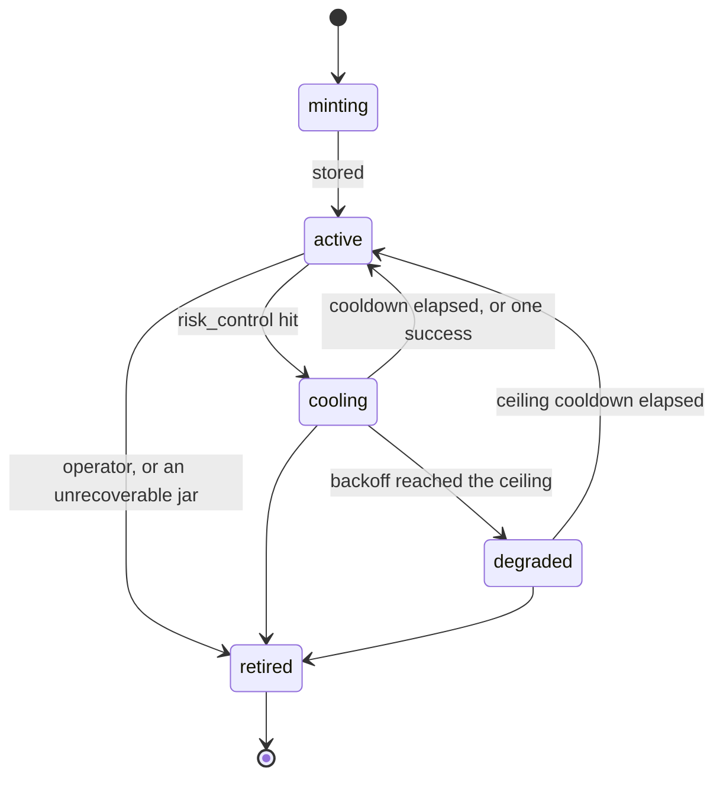

# Concepts

> **[Douyin_TikTok_Download_API](https://github.com/Evil0ctal/Douyin_TikTok_Download_API)** —
> a self-hosted Douyin and TikTok data API: REST, MCP and a web console, with
> an identity pool that maintains itself.
> [All docs](../README.md) · [中文](../zh/04-concepts.md)

This page is the mental model behind the whole system. After reading it you should be able to predict what the instance will do with a request before you send it, and to tell apart the three kinds of failure that look identical from the outside: a bug, a platform change, and the system working exactly as designed.

Nothing here is required to make your first call — [Quick start](./01-quickstart.md) covers that. It is what you need before you tune anything in [Configuration](./03-configuration.md), before you read the Logs page in the console, and before you decide whether an error is worth reporting.

## The shape of one request

Every *served* platform read — from the REST API, from the console Playground, from an MCP client, from the watchlist — goes down the same pipe. There is exactly one implementation of it (`src/dtk/services/fetch.py`), and everything above it is a different way of asking.

One family of calls deliberately stays off it. `dtk fetch`, `dtk identity test` and the console's identity probe assemble a single call by hand (`src/dtk/ops/pipeline.py`), outside the scheduler, the token buckets, the response cache and `request_log`: they exist to answer *is this endpoint dead?* during an incident, and borrowing a lease would make the probe change the very pool state you are trying to read. They share everything that decides correctness — the same URL parser, endpoint tables, signers, transport and classifier — and nothing that decides bookkeeping. See [CLI reference](./13-cli.md).

```text
  caller
    │
    ▼
  response cache ──── hit ───────────────────────────────► answer (no identity spent)
    │ miss
    ▼
  scheduler ─── refused ──► IDENTITY_POOL_EXHAUSTED / ENDPOINT_CIRCUIT_OPEN
    │ lease (one identity, one request)
    ▼
  identity loaded  →  cookies + fingerprint + proxy
    │
    ▼
  signing  →  query parameters and headers the platform will accept
    │
    ▼
  transport  →  TLS profile matched to the fingerprint, sent through the proxy
    │
    ▼
  classification  →  ok │ business_error │ risk_control │ network_error
    │
    ├──► identity bookkeeping (streak, cooldown, state)
    ├──► endpoint circuit window
    └──► one row in request_log
    │
    ▼
  parse  →  normalized model  →  cache write  →  answer
```

Two things follow from that picture, and they explain most of the surprises:

- **A platform read always costs an identity.** There is no anonymous path. If the pool is empty or every identity is busy, there is nothing to serve the request with, and the honest answer is a refusal rather than a wait forever.
- **Every step of a served request is recorded.** The classification decides both what the caller is told and what the pool learns. Getting it wrong in either direction is expensive, which is why a whole section below is about nothing else.

## Identities

An **identity** is the atom this system schedules. It is not a cookie. It is four things bound together for the life of the row:

| Part | What it is | Where it lives |
| --- | --- | --- |
| Cookie jar | The platform's own session cookies — `ttwid` at minimum, ideally `odin_tt`, `s_v_web_id`, `msToken`, `uifid` | `identities.cookies_encrypted`, AES-256-GCM, the row id bound in as additional authenticated data |
| Fingerprint | Browser family and major version, User-Agent, `navigator.platform`, screen geometry, language, timezone, `hardwareConcurrency`, `deviceMemory` | `identities.fingerprint` (JSONB) |
| Proxy binding | The egress this jar was minted behind, or none for the direct connection | `identities.proxy_id` |
| History | Consecutive failure streak, cooldown, state, last use | `identities.state`, `consecutive_fails`, `cooldown_until`, `last_used_at` |

### Why the four parts may never be recombined

Rotating cookies over one shared exit address and one User-Agent is a *stronger* anomaly than plain request frequency. To the platform it looks like a single device cycling through visitors, which is not a thing a real browser does. So the system never moves a jar to a different proxy, never pairs a jar with a different User-Agent, and never signs one identity's request with another identity's session.

The consequences are concrete and occasionally annoying:

- If a proxy dies, the identities behind it are **cooled**, not re-homed (`IdentityPool.cool_all_on_proxy`). The cookies are fine; only the egress is down. A permanently dead proxy eventually means retiring its identities and minting new ones.
- If you delete a proxy, its identities do not migrate. See [Identities and proxies](./06-identities-and-proxies.md).
- **Retiring an identity wipes its cookie jar immediately** (`cookies_encrypted` is set to empty) and keeps the row for its statistics. That is why a retired identity cannot be reset: there is no session left to return to rotation, and a button that appeared to bring one back would be offering a lie.

### A fingerprint that cannot be emulated is refused

Before an identity is stored, the fingerprint must name a browser family *and* a major version. Without both, no TLS profile can be chosen, and the fallback — dressing an unknown browser as a plausible Chrome — is the single loudest self-report a client can make: a Firefox User-Agent over Chrome's TLS handshake. The project's position is that such an identity is worse than no identity at all, so `IdentityPool.add` raises rather than storing it, and a mint that produces one is recorded as `unusable_fingerprint`.

The TLS profile is picked by exact match on the major version first, then the nearest known profile *below* it — never a global default (`src/dtk/transport/emulation.py`). Drift of up to 2 majors is fine, up to 4 warns, beyond that fails.

### Identity states



| State | Meaning | Scheduled? |
| --- | --- | --- |
| `minting` | A browser is producing it right now | No |
| `active` | Normal rotation | Yes |
| `cooling` | Backing off after a risk-control response | Only when a caller pins it by name |
| `degraded` | The backoff hit its ceiling; last resort | Only when the active pool is empty |
| `retired` | Credential wiped, row kept for statistics | Never |

`cooling` and `degraded` are recovered on the *request* path, not by a background sweep: the first time the scheduler asks for active candidates on a platform, anything whose `cooldown_until` has passed is promoted back. A recovered pool becomes usable on the next request rather than on the next sweep tick.

Note what promotion does **not** do: it does not clear the failure streak. Only a successful request does that. So an identity that is still broken computes the same ceiling cooldown on its next risk hit and drops straight back, while its health score keeps it at the bottom of the ranking in the meantime.

## How an identity is minted

Minting means: run a real headless browser, through the proxy this identity will be bound to, let the platform issue its own cookies to it, and record what the browser actually reported about itself.

A browser is involved because there is no other way to get the same three things to agree. The cookie set has to come from the session that will later use it; the fingerprint has to be what that session actually presented; and everything about the exit — timezone, language, screen — has to line up with the proxy's GeoIP, because a proxy in Germany paired with an `Asia/Shanghai` clock is a tell given away for free.

The browser lives in a separate long-running service (`browser-rpc`, reached over `DTK_BROWSER_RPC_URL`), not launched per call: a cold browser start costs seconds.

### The pace is part of the correctness

The pool filler (`src/dtk/worker/pool_filler.py`) mints **exactly one identity per tick**, holds a cross-process Redis lock while doing it so `--scale worker=N` cannot turn one mint into N, and backs off exponentially when minting keeps failing (60s doubling to a 3600s ceiling). Refilling from the low-water mark to the target therefore takes minutes. That is intended: five fresh visitors appearing from one deployment inside a second is itself a stronger signal than anything those identities would go on to do. Nothing waits on minting — it is off the request path entirely.

| Setting | Default | What it decides |
| --- | --- | --- |
| `pool.min_size` | 3 | Low-water mark per platform; below it the filler starts topping up |
| `pool.target_size` | 8 | It keeps going until the usable count reaches this |
| `pool.max_fail_streak` | 3 | Above this streak an identity stops counting toward the pool level, so the filler replaces it instead of counting it |

The level the filler reads is the **usable** count — live identities whose failure streak is still under `pool.max_fail_streak` — not the row count. An identity that fails every request stays live (it cools, its backoff elapses, it is promoted, it fails again), so counting rows lets a pool sit permanently at target while serving nothing.

There is one deliberate exception. If the usable count is zero *and* identities exist, the filler holds the level instead of minting. Everything failing at once is a platform-wide event, and minting into it adds fresh identities to be burned by whatever is burning the others.

### Choosing the egress

The filler picks an egress no live identity of that platform is already using. Two identities behind one exit is exactly the recombination the design forbids, so when every proxy is taken it waits rather than doubling up. A deployment with no proxies configured mints on the direct connection, which is what a user without proxies asked for. The console's Mint button may name a proxy explicitly, and that overrides the search — otherwise a one-proxy install could never mint its second identity.

### Without a browser

`DTK_BROWSER_RPC_URL` unset means no minting at all, and the whole job is skipped rather than logging an error every minute. That deployment lives on **imported** cookies: you paste a jar from your own browser and the instance parses it. Four formats are recognized automatically — a `Cookie:` header, a JSON array from a cookie-editor extension, Netscape `cookies.txt`, and loose `key=value` lines — and the parse is shown to you before anything is stored, including which cookies were found, whether the jar carries a logged-in session (`sessionid`, `sid_tt`, `sid_guard`, …), and the browser it was inferred to be. See [Identities and proxies](./06-identities-and-proxies.md).

An imported logged-in jar is far more valuable than a guest identity and far more damaging to leak. It is also the reason the *pin* exists, described under the scheduler below.

## Request signing

Both platforms require query parameters and headers computed by their own JavaScript. This project reimplements those algorithms in pure Python (`src/dtk/signing/native/`), which costs microseconds and has no external dependency, and keeps the browser as a fallback that runs the site's real code (`src/dtk/signing/rpc.py`).

`signing.mode` decides which is preferred. It ships as `native`.

| Mode | Behaviour |
| --- | --- |
| `native` | Sign everything in-process. The browser is what mints identities, not what signs their requests. |
| `rpc` | Prefer `browser-rpc` for every signature. Where to go the day a platform ships a new SDK and the port goes stale. |
| `auto` | Native, except on the endpoints the platform's own SDK sign-protects, and except when an endpoint's risk rate suggests the signature is being rejected. |

`signing.fallback_enabled` (default on) says whether the non-preferred signer may be used when the preferred one is unavailable. Turning it off is a **diagnostic**: with fallback on, a signer that has stopped working looks healthy, because its traffic quietly moves to the other one. That is exactly how a broken native port stayed "fine" in this codebase while producing signatures no platform accepted.

### Why a signature depends on the User-Agent

The signature is not computed over the URL alone. Douyin's A-Bogus carries the browser geometry — screen size, `navigator.platform`, window and viewport dimensions — *inside* the signed payload, and the same request echoes `screen_width`, the browser version and the OS back in its own query string, next to a User-Agent header claiming the same facts. Sign with one fingerprint and send with another and you have handed the platform a contradiction for free.

So the signer is given the identity's whole fingerprint, and the transport builds the headers from the same fingerprint (`src/dtk/transport/headers.py`): the minting browser's real User-Agent, language and platform win over wreq's generic browser defaults, and Chromium client hints (`sec-ch-ua`) are emitted only for Chrome, because Firefox and Safari do not send them at all.

TikTok enforces this directly: the same signed bytes replayed over a Firefox TLS profile are refused.

### Why a signature depends on the cookie jar

Measured against a live page on 2026-09-08: Douyin's `verifyFp` query parameter **is** the `s_v_web_id` cookie of whatever browser computed the signature. Sign in one session and send the request with another session's cookies and the two name different visitors.

Neither platform answers that with a clean rejection. They withhold the payload — HTTP 200, an intact envelope, and nothing in it. That reads exactly like rate limiting, which is why this is worth understanding before you debug one.

The same coupling shows up in the native signer:

- **TikTok** needs the identity's own `msToken` to produce `X-Dynosaur` and `X-Gnarly`. A jar without one is the case the port cannot cover, so that request goes to the browser.
- **Douyin** needs the identity's `uifid` to produce `x-secsdk-web-signature`, and only on the paths the platform actually sign-protects. That path list is copied from Douyin's own web SDK (`src/dtk/signing/protection.py`) — 14 paths, including `/aweme/v1/web/aweme/detail/` and `/aweme/v1/web/aweme/post/`. Everything outside the list is sent unsigned by Douyin's own pages, so the native signer is not a degraded option there; it is the same request the site would send.

### The query string is bytes, not parameters

A signature is computed over an exact byte sequence. The signed query string travels verbatim from the signer to the wire — it is never re-encoded from a parameter dictionary. A single extra percent-escape (`/` becoming `%2F` inside a base64 `X-Gnarly`) invalidates it, and the platform's answer to an invalid signature is, again, 200 with an empty body.

If you ever reproduce a request by hand, this is the trap. The `explain` option on a fetch hands you the request exactly as it went out — signed URL, headers and jar — so you do not have to guess; see [Playground and tools](./07-playground-and-tools.md). It requires the `admin` or `identity:manage` scope because the answer contains a credential, and it is audited.

## The scheduler

The scheduler answers exactly one question — *which identity may send this request right now?* — or refuses with a reason that can be shown to the caller and recorded in `request_log`.

### Health ranking

Each candidate identity gets a score in `[0, 1]`:

```text
score = success_rate × (1 − risk_rate) × 0.5 ^ consecutive_fails
```

- `success_rate` is ok/total over the last **15 minutes**, or the configured prior (`pool.health_prior`, default `0.8`) when there are fewer than 5 observations. A freshly minted identity is neither trusted like a proven one nor buried for having no history.
- `risk_rate` is risk-control responses over total, over the last **60 minutes**.
- Each consecutive failure halves the score.

The three factors **multiply** rather than sum, because they are not commensurable: two are rates and one is an unbounded count, and in a weighted sum any non-trivial weight on the streak lets it dominate. Multiplying means any one factor collapsing drags the whole score down, which is the intuitive behaviour — an identity that was just rate-limited should not be picked first however good its history looks.

The rates are read from a TimescaleDB continuous aggregate (`identity_health_5m`) rather than from the raw log, so the scheduler's path never scans the hypertable. If that read fails, the scheduler loses ranking accuracy for one call and carries on; it never loses the request.

### Quantised least-recently-used rotation

Identities are ordered by **health tier** (5 coarse buckets, not the exact score), then **least recently used**, then a stable per-call jitter.

Bucketing is the point. Ordering on the exact score makes the single healthiest identity win every time, creating a hot spot; bucketing lets LRU operate *inside* a tier, which is what "take turns" actually means. Recency is likewise rounded to a quantum before comparing — 0.5s, a code constant (`SchedulerConfig.lru_quantum_seconds`) that nothing reads from configuration — on exact timestamps every candidate is distinct, the jitter is never reached, and concurrent callers all cascade down one shared order.

Worth naming as a trade-off rather than a feature: **measured against a uniform random baseline, the resulting spread is no better than chance.** The code says so, and the fairness test says so. The quantisation is there to make concurrent callers diverge, not because it demonstrably distributes load better.

The last-use timestamp used for ranking comes from Redis, taking whichever of Redis and the database saw the identity more recently. The database column is written after the request completes, so ranking on it alone lets several back-to-back requests read the same stale order and pick the same identity.

### Per-(identity, endpoint) token bucket

Each identity holds a separate budget for each endpoint. The quota is keyed on the pair, not on the identity alone, because without the endpoint dimension one identity can spend its entire allowance on the single most sensitive call — which reads as "this visitor only ever does one thing, and does it constantly", a stronger signal than an even spread.

| Endpoint | Burst | Refill/sec | Risk weight |
| --- | --- | --- | --- |
| `*.content_detail` | 5 | 0.30 | 1.0 |
| `*.author_profile` | 4 | 0.20 | 1.2 |
| `*.author_posts` | 3 | 0.12 | 1.8 |
| `*.author_likes` | 3 | 0.12 | 1.8 |
| `*.comments`, `*.comment_replies` | 3 | 0.15 | 1.5 |
| `*.mix_posts` | 3 | 0.15 | 1.5 |
| `tiktok.author_followers`, `tiktok.author_following` | 3 | 0.12 | 1.8 |
| `*.session_check` | 3 | 0.20 | 1.0 |
| anything unregistered | 3 | 0.15 | 1.5 |

A refill of `0.12/sec` means one request every 8.3 seconds, per identity, on that endpoint, once the burst is spent. That is the throughput ceiling of a single identity — the way to go faster is more identities, not a bigger bucket. The risk weight multiplies the cooldown an identity earns when that endpoint gets it risk-controlled.

Alongside the bucket is an **in-flight lock, one per identity, across all endpoints**. One identity makes one request at a time; a real session does not issue parallel API calls. The lock has a 120-second TTL so a worker that dies mid-request does not strand the identity forever, and it is released with a lease-id check so a late release cannot free a lock that now belongs to somebody else.

The bucket check and the lock are taken together in one Lua script. Checking budget and then separately taking the lock would leave a window in which several workers all observe budget and all proceed — breaching the quota precisely when the system is busiest.

The token is refunded **only** for a `network_error`. A request that never reached the platform did not spend the identity's allowance; a refusal did.

### Per-endpoint circuit breaker

One identity getting rate-limited is routine. Every identity failing on the same endpoint is a different event — usually a changed upstream API or a dead signer — and continuing to retry only burns the pool.

Three conditions must hold together over a rolling 300-second window:

| Condition | Setting | Default |
| --- | --- | --- |
| Risk rate above the threshold | `sched.circuit_risk_threshold` | `0.6` |
| At least this many observations | `sched.circuit_min_samples` | `20` |
| Failures span at least this many distinct identities | `sched.circuit_min_identities` | `3` |

The third is what separates "the endpoint broke" from "one identity broke". Without it, a single flapping identity trips the whole endpoint for everyone.

An open circuit lasts 300 seconds and lets exactly one probe through per 60 seconds. Recovering at full allowance immediately re-trips almost every time, so the endpoint reopens only after a probe actually succeeds. When it opens, the operator is paged once (the notifier holds a 30-minute window, so the next thousand requests into the same open circuit page nobody).

### Refusals

Waiting is bounded: `sched.max_wait_seconds` (default `10`), polled every 250ms. Rejecting early beats queueing indefinitely — a caller left hanging for a minute before failing is worse off than one told to retry immediately. Two refusals skip the wait entirely, because polling cannot change the answer.

| `reject_reason` | Meaning | Waits? | Error the caller sees |
| --- | --- | --- | --- |
| `circuit_open` | This endpoint is tripped for everyone | No | `ENDPOINT_CIRCUIT_OPEN` (503) |
| `pinned_unavailable` | The named identity is retired, still minting, or on another platform | No | `INVALID_PARAM` (400) |
| `no_identity` | No active or degraded identity exists for this platform | Yes | `IDENTITY_POOL_EXHAUSTED` (503) |
| `no_token` | Every candidate is out of quota on this endpoint | Yes | `IDENTITY_POOL_EXHAUSTED` (503) |
| `all_inflight` | Every candidate is mid-request | Yes | `IDENTITY_POOL_EXHAUSTED` (503) |
| `wait_timeout` | The wait budget ran out | — | `IDENTITY_POOL_EXHAUSTED` (503) |
| `queue_full` | The task queue is at `sched.queue_max` (default 500). Not the scheduler's: refused at submission, before a task or a lease exists | — | `QUEUE_FULL` (503) |

`pinned_unavailable` is deliberately a 400 and not a 503: the pool is fine, and waiting will not mend a parameter naming an identity that cannot serve the request.

`queue_full` is the odd one out in that table. It is raised by the API when a submission arrives at the queue ceiling (`src/dtk/api/routes/operations.py`), before there is a task to schedule, so it reaches the caller in the error envelope's `details.reject_reason` and never becomes a `request_log` row. The other six are the scheduler's own, and those are the ones the Logs page can show you.

### Pinning an identity

A caller with the `admin` or `identity:manage` scope (and at least the `operator` role) may name one identity that a request must go out on. **A pin is a pool of one.** It never widens on any refusal, for any reason.

That is the whole point of pinning: the case it exists for is a jar imported from your own logged-in browser, where the content is visible to that session and to no other. Quietly serving it from a substitute identity would not degrade the answer, it would change what was asked. A pinned request also gets exactly one transport attempt instead of three, and neither reads nor writes the shared response cache — a session-scoped answer must not be written to a cache other code paths can read.

Cooling identities *are* eligible for a pin. Cooling is a judgement about the shared pool; a caller fetching their own account's posts with their own jar has knowingly stepped outside it. Retired ones are not, because the jar is gone.

## Outcome classification

Every upstream response lands in exactly one of four categories. The whole system's health bookkeeping hangs off this one decision.

| Outcome | Meaning | Effect on the identity | Effect on the endpoint |
| --- | --- | --- | --- |
| `ok` | The request worked | Clears the failure streak; a cooling identity returns to active | Counts as a success; closes an open circuit if it was a probe |
| `business_error` | The platform answered; the content is gone, private or nonexistent | **Nothing at all** | Counted as a non-risk sample |
| `risk_control` | The platform refused this identity | Streak +1, cooldown, `cooling` or `degraded` | Counts toward the trip decision |
| `network_error` | No answer at all: proxy, DNS, TLS, timeout | Streak +1, no cooldown | Not a risk sample; token refunded |

### Why the business/risk split is load-bearing

V4 of this project treated every non-200 the same. Looking up one deleted video was enough to condemn a perfectly good cookie. That is the failure mode this split exists to prevent, and it is not hypothetical — the current codebase has repaired several instances of it, each found by measuring against the live platforms:

- Douyin answers a post that does not exist with HTTP 200, `status_code: 0`, a null `aweme_detail`, and a `filter_detail` block naming the post and a reason code (`core_dep` for "no such post", `status_self_see` for owner-only). The empty payload alone is *exactly* the risk-control signature, so reading it that way cooled the identity for every typo'd id and counted toward the endpoint's risk rate — enough for a caller walking a list of ids to trip the breaker and take the endpoint down for everyone.
- TikTok answers a deleted post with HTTP 200 and **two** status fields: `statusCode: 10204` and `status_code: 0`. Reading the wrong one saw an envelope of nothing but metadata and called it risk control.
- Douyin's `author_likes` answers a private likes list with **zero bytes**. Everywhere else an empty body is a refusal, so this had to become a property an endpoint declares about itself rather than a global rule.

The inverse mistake costs less but is still real: a misread risk response leaves a burnt identity in rotation, ranked as healthy.

### The rule chain

Classification is an ordered list of predicates over tables (`src/dtk/transport/classify.py`). The first match wins; no match means `ok`. The matched rule name is stored on the log row, so a shift in the *mix* of risk signals is visible without re-reading bodies.

| # | Rule | Outcome | Fires on |
| --- | --- | --- | --- |
| 1 | `http.network_status` | `network_error` | 407, 408, 502, 503, 504, 520–524 |
| 2 | `envelope.risk_code` | `risk_control` | Body status `10000` (TikTok's verification envelope) |
| 3 | `envelope.business_code` | `business_error` | Body status `2`, `2053`, `10201`, `10204`, `100002` |
| 4 | `body.challenge_marker` | `risk_control` | `captcha`, `verify_center`, `secsdk`, `slide_verify`… in the first 4096 bytes |
| 5 | `signature.refused` | `risk_control` | A refusal status whose body says `uifid not found`, `signature not found`, `sign invalid`, `sign expired` |
| 6 | `http.risk_status` | `risk_control` | 401, 403, 405, 412, 429, 444 |
| 7 | `http.business_status` | `business_error` | 400, 404, 410, 451 |
| 8 | `envelope.nonzero` | `business_error` | Any other non-zero platform status code |
| 9 | `signature.rejected` | `risk_control` | A 2xx carrying TikTok's `tt_orcas_res` header |
| 10 | `body.silent_answer` | `business_error` | Empty body, on an endpoint that declares its silence means "private" |
| 11 | `body.empty` | `risk_control` | Empty body on any other 2xx (204/205 excepted) |
| 12 | `payload.explained` | `business_error` | Empty payload key, with `filter_detail` naming a reason |
| 13 | `payload.withheld` | `risk_control` | Empty payload key, with nothing said about it |
| 14 | `payload.bare_envelope` | `risk_control` | A 200 whose body is a status and trace ids and nothing else |
| 15 | `http.server_error` | `network_error` | Any other status ≥ 500 |
| 16 | `http.client_error` | `business_error` | Any other status ≥ 400 |
| — | `default.ok` | `ok` | Nothing matched |
| — | `exception.*` | `network_error` | The request produced no response at all |

Two ordering decisions carry weight:

- **The platform's own envelope is read before the HTTP status**, because these APIs answer business errors with HTTP 200 and a body-level code.
- **Body markers are scanned only when the envelope is absent or non-zero.** A captcha interstitial is HTML or a non-zero envelope; a video description that happens to contain the word "captcha" is neither, and scanning blindly would cool a healthy identity over user-generated text.

Note rules 5 and 9. Both mean *our signature was rejected*, not *this identity is burnt* — but both are still `risk_control`, because the request really was refused and classifying a broken signer as a normal business answer is exactly what lets it ship unnoticed. The rule *name* is what sends you to the signer instead of to the identities. Tripping the circuit here is the desired behaviour: it stops the pool hammering an endpoint with signatures it will never accept.

### Retrying

A `network_error` is retried on a **different** identity — up to `MAX_TRANSPORT_ATTEMPTS` (3) attempts — because the fault is in the egress rather than in the request. If three separate exits cannot reach the platform, the problem is not the identity, and the caller gets a 500 naming the last error.

`risk_control` and `business_error` are not retried. They are answers.

A pinned request gets one attempt: retrying lands on the same identity, and three attempts would spend three tokens out of a bucket that holds three to five.

## Asynchronous requests, tasks and the response envelope

Fetching from a platform costs a real upstream call on a real identity and can take seconds, and the scheduler may have no identity available at any moment. An endpoint that promised an immediate answer would hold connections open under pressure — and held connections occupy the very workers needed to drain the backlog, which is how a slowdown becomes a collapse.

So the data endpoints are **asynchronous by default**. They queue the work and answer `202` with a task id.

```text
POST /api/v1/parse            -> 202 {"task_id": "...", "state": "queued"}
GET  /api/v1/tasks/{task_id}  -> 200 {"state": "done", "data": {...}}
```

Three ways to collect the result, differing only in who does the waiting:

- **Poll the task.** Always works; what a client with its own event loop should do.
- **`?wait=N`.** The server holds the connection until the task settles, up to `N` seconds and up to the instance ceiling `api.max_wait_seconds` (default 30). Finished in time: `200` with the result. Not finished: `202` and the task id — **not an error, and nothing was lost**. Above the ceiling: `400`, rejected rather than silently shortened, because a caller that asked to block for five minutes needs to learn it cannot.
- **`callback_url`.** A notification that the task finished is POSTed to you — `event`, `task_id`, `endpoint`, `state`, `sent_at`, and a short `error` when it failed, never the result itself; collect that with `GET /api/v1/tasks/{task_id}`. A result can be megabytes, and posting it to a third party is a data-flow decision nobody makes by typing a URL into a field. Because a caller-supplied callback URL is a request-forgery vector, it is off unless an administrator sets `security.enable_task_webhook`, the URL must be `https`, and its host must not be loopback, private or link-local — checked at submission and again at delivery. (`security.url_allowlist` has nothing to do with callbacks; it governs which hosts a *short link* may redirect through. The OpenAPI front page says otherwise and is wrong — see the [REST API guide](./11-api.md).)

Nothing changes internally between the three. The work goes through the same queue either way.

Task state is `queued → running → done | failed`. Results are kept for `retention.task_result_hours` (default 24) and can be read as often as you like within that window; afterwards the metadata survives and the payload is blanked. Cancelling only stops a task that is still `queued` — a running one is already in flight against the platform, its identity's quota is already spent, and recording a failure the worker did not have would make the endpoint's risk rate lie to the circuit breaker.

### One envelope, always

Every response — success or failure, REST or console — has the same four top-level keys:

```json
{
  "success": true,
  "data": { },
  "error": null,
  "meta": { "request_id": "…", "cached": false, "duration_ms": 412 }
}
```

`error.code` is a stable enum you can branch on; it is append-only and never renamed and never translated. `error.message` beside it is localized (`?lang=zh`) and must never be parsed. `meta.request_id` on a **finished result** — a `?wait=` call that completed, or the result of a polled task — is the id written to `request_log`, which is what makes a bug report actionable. On the `202` that acknowledges a submission it is only the HTTP correlation id (the same value as the `X-Request-ID` header), and it has no log row of its own: the worker that later runs the task generates its own fetch request id, and that is the one the Logs page holds.

Some codes are marked non-retryable and are advertised as such, so an agent does not burn its budget looping on a permanent failure: `INVALID_URL`, `UNSUPPORTED_CONTENT`, `INVALID_PARAM`, `UNAUTHENTICATED`, `FORBIDDEN_SCOPE`, `NOT_FOUND`, `CONTENT_PRIVATE`, `UPSTREAM_CHANGED`, `CANCELLED`, `METHOD_NOT_ALLOWED`, `UNSUPPORTED_MEDIA_TYPE`, `NOT_CONFIGURED`, and the two setup codes. Full detail in the [REST API guide](./11-api.md) and [MCP and AI agents](./12-mcp.md).

### One row per request

`request_log` is the source of truth for pool health, the Logs page and the console's charts. `FetchService` is its only writer, and it writes a row for **every** attempt: cache hits (which spend no identity), scheduler refusals (which never reached the platform), transport failures, and successes alike. A path that skipped it would be a hole in the console, in the health aggregates and in the audit trail at once.

The circuit breaker is the one consumer that does *not* read it. It keeps its own rolling 300-second window in Redis (`sched:window:{endpoint}`), written as each lease is released, and both the trip decision and the console's per-endpoint health board read that window rather than the log. The two therefore answer different questions — *is this endpoint usable right now?* against *what did the last day look like?* — and will not always agree; [Console overview](./05-console-overview.md) says where each number comes from.

Each row carries the request id, the endpoint, the identity, the proxy, the API key, the outcome, the HTTP status, the duration, whether it was a cache hit, which signer produced the signature, the matched rule name for anything that implicated the identity or the egress, and the scheduler's refusal reason where there was one.

## The response cache and request coalescing

Two separate mechanisms, both there to stop repeated questions costing repeated identities.

**The response cache** is keyed on the normalized business parameters — not the raw URL — so two callers who reach the same content by different URL spellings land on the same entry. TTLs come from settings:

| Setting | Default | Applies to |
| --- | --- | --- |
| `cache.content_ttl` | 1800s | Content detail |
| `cache.author_ttl` | 900s | Author profile |
| `cache.list_ttl` | 300s | Posts, comments, replies, likes, mixes, followers, following |

A cache hit costs no identity quota, which makes it the cheapest protection the pool has. It is still logged as a request, with `cache_hit` set — a Logs page that omitted them would make a cache that has started serving everything look like an endpoint nobody is calling.

Two things are part of the cache key beyond the parameters, each because leaving it out produced a real wrong answer: whether `raw` payloads were requested, and which egress the caller supplied (hashed, since a proxy URL can carry credentials — the platforms answer differently by region). A **pinned** request bypasses the cache entirely in both directions.

`?refresh=true` skips the read but still performs the write: "do not read the cache" and "do not keep this" are different requests, and only the first was asked for.

**Coalescing** works one layer up, at submission. When a hundred callers ask for the same video at once, the first task claims the digest in Redis (90-second TTL) and the other ninety-nine attach to that same task instead of queuing their own. That matters most exactly when the pool is tight.

A claim left by a task that already *failed* is dropped rather than joined — replaying a failure for the rest of the TTL would hide a retry that might well succeed. And requests that are not really identical are never joined: a different caller-supplied proxy, a different pinned identity, `refresh`, and `explain` all enter the digest.

## The archive versus stored media

These are two different things and the difference is the point.

**The archive** is a *record*: the parsed post and author as structured rows in Postgres (`archived_contents`, `archived_authors`), plus a history of counters in `content_snapshots`. Before it existed, a parsed post lived 24 hours in the task result and was then gone — the instance could still say that a request happened and how many plays a video had at time T, but not what the video was called, who made it, or what tags it carried.

**Stored media** is *bytes on your disk*: the actual video and image files, fetched by the media sidecar into a volume, indexed by one row per download in `media_downloads`.

| | Archive | Stored media |
| --- | --- | --- |
| What it holds | Normalized metadata, derived classifications, counter history | Files, their sizes and SHA-256 digests |
| Where | Postgres | The media volume, plus an index row |
| Turned on by | `archive.enabled` | `media.enabled` |
| Grows with | Every parsed post | Every download you ask for |
| Retention | Nothing prunes it automatically. `retention.content_days` is declared but **no code reads it**, so it is inert at any value; remove posts from the Library by hand | `media.max_bytes`, oldest unpinned evicted first |

Three consequences worth internalising:

- **A cache hit archives nothing.** The cached dict is returned without invoking the parser, so there is no model to archive. `last_seen_at` therefore undercounts, and the design says so rather than pretending otherwise.
- **A download row outlives its files.** Eviction under the size ceiling sets `files_removed_at` and leaves everything else, so "collected and later cleaned up" stays distinguishable from "never fetched". Only the first can be undone by asking again.
- **Pinning a download is the only exemption from eviction, and nothing sets it automatically.** A size-based policy without an exemption eventually deletes the one file somebody meant to keep, and once the platform has taken the post down there is no getting it back.

The archive also answers a question the platforms will not: *which of the things I saved are gone?* A background sweep re-checks archived posts and records `live`, `deleted`, `private` or `unknown`. `unknown` is what a failed check leaves behind, and it is deliberately not `deleted` — an archive that quietly reclassified posts on a network blip would be worse than one that admits it does not know.

Callers never supply a media URL. A download names a post this instance has already parsed, the mirrors come from the archive, and anything failing the media host allowlist is dropped with a reason before a job exists. Archived CDN links expire — a TikTok video URL carries `expire=` and a link stored yesterday can answer 403 — so a download re-parses the post when the stored mirrors are older than `media.mirror_max_age_seconds`. See [Downloads, library and watchlist](./08-downloads-and-library.md).

## Scopes, roles and API keys

Two kinds of caller, two mechanisms, one principal. The console uses a server-side session cookie; a script or an agent uses an API key in `X-API-Key` (or `Authorization: Bearer`). Routes never branch on which was used.

### Scopes bound an API key

| Scope | Grants |
| --- | --- |
| `douyin:read` | Douyin platform reads |
| `tiktok:read` | TikTok platform reads |
| `archive:read` | Read what this instance has already stored |
| `archive:export` | Walk the whole archive in one request |
| `media:read` | See what media is stored on disk |
| `media:write` | Start, pin or cancel a download |
| `identity:manage` | Identities, proxies, pinning a request, `explain` |
| `admin` | Everything |

The separations are deliberate rather than decorative. `archive:read` is not implied by a platform read scope: an operator may open a platform endpoint to unauthenticated callers, and "read Douyin" must not thereby become "read everything this instance has ever collected". `archive:export` is its own scope because a bulk export is the single call that turns a read key into a copy of the database. `media:write` is separate from `media:read` because starting a download spends an identity and fills a disk — the only read-shaped call in this API with a lasting side effect on the host.

Reading a task result requires the scope that creating it required, so a key holding only `archive:read` cannot read a comments payload back out of a task id it was handed.

### Roles bound a console account

`demo` < `viewer` < `operator` < `admin`, a ladder rather than a set: an administrator can do anything an operator can. The `demo` role at the bottom exists only while demo mode is on.

| Surface | Requires |
| --- | --- |
| Any authenticated read | Any role |
| Console-side admin reads | `admin` or `identity:manage` scope |
| Pool, proxy and key maintenance | The same, plus at least `operator` |
| Users, sensitive settings, backup and restore | `admin` scope and `admin` role |
| Pinning a request, or `explain` | At least `operator` |

### The rule that catches people out

**An API key is bounded by its scopes even when it belongs to an administrator.** A console *session* carries the account's full role and every scope, because the console is the surface roles were written for. A key does not. Almost every key on a self-hosted instance belongs to the admin user, so an admin-role shortcut would have made `archive:export` unenforceable in exactly the deployment it was written for.

Keys are shown once at creation; only the prefix (e.g. `dtk_a1b2c3d4`) and a SHA-256 digest are stored. A key can carry its own per-minute rate limit, otherwise `api.default_rate_limit_per_min` (default 120) applies. Rate limiting here is abuse protection, not metering and not billing: its only purpose is stopping one runaway script from draining the identity pool.

### Opening an endpoint to the public

Every endpoint requires a credential by default. `api.public_endpoints` lists exceptions by `"<METHOD> <path template>"`, exactly as they appear in the API document. Three groups can **never** be opened whatever the setting says — `/api/v1/admin/*`, `/api/v1/auth/*` and `/api/setup/*` — and there is no override. An anonymous caller on an opened endpoint gets `douyin:read` and `tiktok:read` and nothing else, and is rate-limited by client address rather than by key.

One subtlety: bad credentials are not the same as none. A caller that sends a key the instance rejected is told so even on an open endpoint. Silently downgrading them to anonymous would turn "your key expired" into "your key works but sees less", which is the harder of the two to diagnose. More in [Users and API keys](./09-users-and-api-keys.md) and [Security](./15-security.md).

## Failures that are nobody's bug

With the model above, most errors classify themselves. This table is the short version; [Troubleshooting](./14-troubleshooting.md) is the long one.

| What you see | What it means | Is it a bug? |
| --- | --- | --- |
| `IDENTITY_POOL_EXHAUSTED` right after startup | Minting takes minutes by design, one identity at a time | No. Wait, or import a jar. |
| `IDENTITY_POOL_EXHAUSTED` under load | You are asking faster than the token buckets refill | No. Add identities and proxies; the bucket is not the knob. |
| `ENDPOINT_CIRCUIT_OPEN` | ≥3 identities failed ≥60% of ≥20 requests on that endpoint in 5 minutes | Probably not the instance. Check the signer and the platform. |
| `NOT_FOUND` on a link that works in a browser | The platform answered that the post is gone, private, or owner-only | No. `business_error` costs no identity health, by design. |
| `UPSTREAM_RISK_CONTROL` | That identity was refused — cooled, streak incremented | Not a bug on its own. A whole pool at once is an event. |
| `UPSTREAM_CHANGED` | The response no longer matches what the parser expects | Worth reporting. Quote the `request_id`. |
| A `signature.refused` or `signature.rejected` rule in the Logs page | *Our* signature was rejected, not the identity | Report it — the platform's SDK likely moved. |
| A degraded identity that never recovers | Promotion returns it to active but does not clear the streak; only a success does | No. Reset it by hand if the failures were not its fault. |
| An identity that will not mint, silently | No `DTK_BROWSER_RPC_URL`, or every proxy is already bound | No. The mint log on the Identities page names the reason. |

The general shape: **if the platform answered, the identity is innocent; if the platform refused, the identity pays; if nothing answered, the egress pays; and if our own signature was refused, the identity pays anyway but the rule name tells you where to look.**

## Where to go next

- [Configuration](./03-configuration.md) — every setting named above, with its scope and default
- [Identities and proxies](./06-identities-and-proxies.md) — minting, importing, binding, retiring
- [Console overview](./05-console-overview.md) — where each of these numbers is displayed
- [Operations](./10-operations.md) — what to watch and what to do about it
- [REST API guide](./11-api.md) — the envelope, the endpoints, the parameters
- [FAQ and glossary](./17-faq.md) — the terms on this page, defined in one line each
