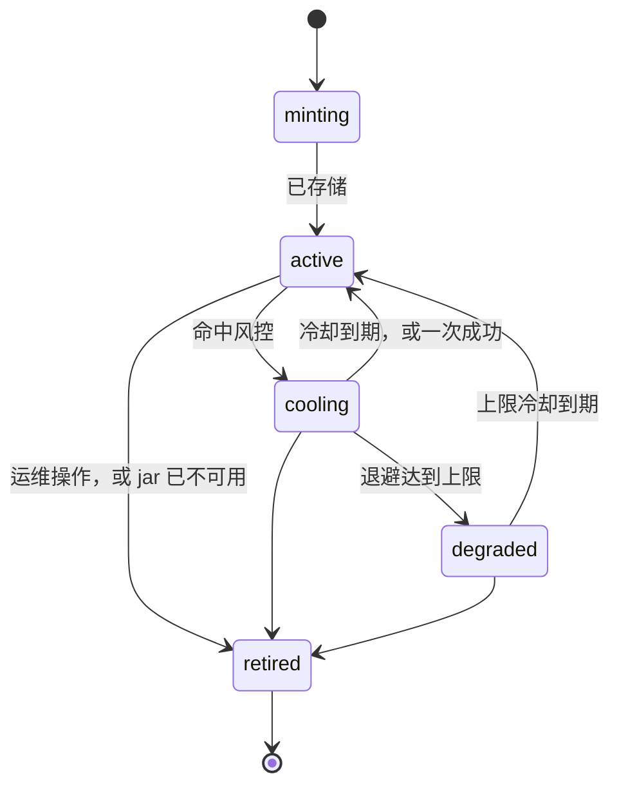

# 核心概念

> **[Douyin_TikTok_Download_API](https://github.com/Evil0ctal/Douyin_TikTok_Download_API)** ——
> 自部署的抖音 / TikTok 数据接口服务：REST、MCP 和 Web 控制台，身份池自维护。
> [文档首页](../README.zh-CN.md) · [English](../en/04-concepts.md)

本页讲的是整套系统背后的心智模型。读完之后，你应该能在发出请求之前就预判实例会怎么处理它，并且能区分三种从外部看起来完全一样的失败：真正的 bug、平台改动，以及系统完全按设计工作。

跑通第一个请求并不需要这些内容，那是[快速开始](./01-quickstart.md)的事。但在你动[配置参考](./03-configuration.md)里的任何一项之前、在你看控制台的「日志」页面（/logs）之前、在你判断某个错误值不值得提 issue 之前，你需要这一页。

## 一次请求的形状

所有**对外服务的**平台读取——不管来自 REST API、控制台「调试台」、MCP 客户端还是关注列表——都走同一条管道。这条管道只有一份实现（`src/dtk/services/fetch.py`），上层的一切只是不同的提问方式。

有一类调用刻意不在这条管道上。`dtk fetch`、`dtk identity test` 以及控制台的身份探测会手工拼出单独一次调用（`src/dtk/ops/pipeline.py`），绕开调度器、令牌桶、响应缓存和 `request_log`：它们存在的意义是在故障中回答某个端点是不是已经死了，而借用一个租约会让探测本身改变你正想读的那份池子状态。它们共享一切决定正确性的东西——同一个 URL 解析器、同一份端点表、同一批签名器、同一个传输层和同一套分类器——但不共享任何记账。见[命令行参考](./13-cli.md)。

```text
  调用方
    │
    ▼
  响应缓存 ──── 命中 ─────────────────────────────────────► 返回结果（不消耗身份）
    │ 未命中
    ▼
  调度器 ─── 拒绝 ──► IDENTITY_POOL_EXHAUSTED / ENDPOINT_CIRCUIT_OPEN
    │ 租约（一个身份，一次请求）
    ▼
  加载身份  →  cookies + 指纹 + 代理
    │
    ▼
  签名  →  平台会接受的 query 参数与请求头
    │
    ▼
  传输  →  与指纹匹配的 TLS 档案，经代理发出
    │
    ▼
  结果分类  →  ok │ business_error │ risk_control │ network_error
    │
    ├──► 身份记账（连续失败次数、冷却、状态）
    ├──► 端点熔断窗口
    └──► request_log 写入一行
    │
    ▼
  解析  →  归一化模型  →  写缓存  →  返回结果
```

从这张图能推出两件事，它们解释了大部分让人意外的行为：

- **一次平台读取一定要花掉一个身份。** 不存在匿名通道。如果池子空了、或者所有身份都在忙，就没有东西能承载这个请求；诚实的做法是直接拒绝，而不是让调用方无限等待。
- **对外服务的请求，每一步都会被记录。** 分类结果同时决定了返回给调用方的内容和身份池学到的东西。往任何一个方向判错代价都很大，所以下面专门有一整节讲它。

## 身份（Identity）

**身份**是这套系统调度的最小单位。它不是一份 cookie，而是四样东西在这一行记录的生命周期内绑死在一起：

| 组成 | 具体是什么 | 存放位置 |
| --- | --- | --- |
| Cookie jar | 平台自己签发的会话 cookie —— 至少要有 `ttwid`，理想情况还包括 `odin_tt`、`s_v_web_id`、`msToken`、`uifid` | `identities.cookies_encrypted`，AES-256-GCM，行 id 作为附加认证数据绑定进去 |
| 指纹 | 浏览器系列与主版本号、User-Agent、`navigator.platform`、屏幕尺寸、语言、时区、`hardwareConcurrency`、`deviceMemory` | `identities.fingerprint`（JSONB） |
| 代理绑定 | 这份 jar 是在哪个出口后面铸造的，或者为空表示直连 | `identities.proxy_id` |
| 历史 | 连续失败次数、冷却时间、状态、最近使用时间 | `identities.state`、`consecutive_fails`、`cooldown_until`、`last_used_at` |

### 为什么这四部分永远不能重新组合

在一个共享出口和一个 User-Agent 上轮换 cookie，比单纯的请求频率**更像**异常。在平台看来，那就是一台设备在轮流扮演不同访客，而真实浏览器不会这么做。所以系统永远不会把一份 jar 挪到别的代理上，永远不会把 jar 和别的 User-Agent 配对，也永远不会用某个身份的会话去给另一个身份的请求签名。

后果非常具体，偶尔还挺让人不爽：

- 代理挂了，它后面的身份会被**冷却**而不是换出口（`IdentityPool.cool_all_on_proxy`）。cookie 本身没问题，坏掉的只是出口。一个永久失效的代理，最终意味着退休它的身份并铸造新的。
- 删除代理时，它的身份不会迁移。见[身份与代理](./06-identities-and-proxies.md)。
- **退休身份会立刻抹掉它的 cookie jar**（`cookies_encrypted` 置空），只保留这一行的统计数据。这也是退休身份无法被重置的原因：已经没有会话可以放回轮换了，提供一个看起来能复活它的按钮，等于提供一个谎言。

### 无法模拟的指纹会被直接拒绝

存储身份之前，指纹必须同时给出浏览器系列**和**主版本号。两者缺一就无法选择 TLS 档案，而退路——把未知浏览器打扮成一个看似合理的 Chrome——是客户端能做出的最响亮的自我暴露：Firefox 的 User-Agent 配 Chrome 的 TLS 握手。本项目的立场是这样的身份比没有身份更糟，所以 `IdentityPool.add` 会直接抛错而不是存下来，产生这种指纹的铸造会被记为 `unusable_fingerprint`。

TLS 档案的选择规则是：先按主版本号精确匹配，然后取**低于**它的最近一个已知档案——绝不使用全局默认值（`src/dtk/transport/emulation.py`）。相差 2 个主版本以内没问题，4 个以内告警，再多就失败。

### 身份状态



| 状态 | 含义 | 是否参与调度 |
| --- | --- | --- |
| `minting` | 浏览器正在铸造它 | 否 |
| `active` | 正常轮换 | 是 |
| `cooling` | 命中风控后退避中 | 仅当调用方按名字指定（pin）它时 |
| `degraded` | 退避已到上限，属于最后手段 | 仅当活跃池为空时 |
| `retired` | 凭据已抹除，保留行用于统计 | 永不 |

`cooling` 和 `degraded` 的恢复发生在**请求路径**上，而不是靠后台扫描：调度器第一次为某个平台索取活跃候选时，`cooldown_until` 已过的身份就会被提回来。这样恢复的池子在下一次请求时就可用，而不是要等下一轮扫描。

注意提回来**不做**什么：它不清空连续失败计数。只有一次成功的请求才会清空。所以一个仍然坏着的身份，在下一次风控命中时会算出同样的上限冷却并立刻掉回去；在此期间它的健康分会把它压在排序末尾。

## 身份是怎么铸造出来的

铸造的含义是：跑一个真正的无头浏览器，走这个身份将来要绑定的那个代理，让平台把自己的 cookie 发给它，并记录浏览器真实上报的一切。

之所以要用浏览器，是因为没有别的办法让三件事互相对得上。cookie 必须来自将来真正使用它的那个会话；指纹必须是那个会话实际呈现出来的样子；而与出口有关的一切——时区、语言、屏幕——必须和代理的 GeoIP 对齐，因为德国的代理配上 `Asia/Shanghai` 的时钟，等于白送对方一个破绽。

浏览器跑在一个独立的长驻服务里（`browser-rpc`，通过 `DTK_BROWSER_RPC_URL` 访问），不是每次调用现拉一个：冷启动一个浏览器要花好几秒。

### 速度本身就是正确性的一部分

池填充器（`src/dtk/worker/pool_filler.py`）**每个 tick 只铸造一个身份**，铸造期间持有一把跨进程的 Redis 锁，这样 `--scale worker=N` 不会把一次铸造变成 N 次；铸造持续失败时按指数退避（60 秒起，翻倍至 3600 秒上限）。因此从低水位补到目标值要花上几分钟。这是刻意的：一个部署在一秒内冒出五个全新访客，本身就比这些身份之后要做的任何事都更像信号。没有任何请求会等待铸造——它完全不在请求路径上。

| 配置项 | 默认值 | 决定什么 |
| --- | --- | --- |
| `pool.min_size` | 3 | 每个平台的低水位；低于它填充器开始补货 |
| `pool.target_size` | 8 | 一直补到可用数量达到这个值 |
| `pool.max_fail_streak` | 3 | 连续失败次数超过它，该身份不再计入池水位，填充器会补一个新的而不是把它算进去 |

填充器读的是**可用**数量——连续失败次数仍低于 `pool.max_fail_streak` 的存活身份——而不是行数。一个每次请求都失败的身份仍然是"存活"的（它冷却、退避到期、被提回、再失败），所以按行数统计会让池子永远停在目标值上却什么都服务不了。

有一个刻意的例外：当可用数量为零**而且**确实存在身份时，填充器会按住水位不铸造。所有身份同时失败是一起平台级事件，往里面铸造只是给正在烧身份的那个东西送新柴。

### 出口的选择

填充器会挑一个该平台还没有存活身份在用的出口。两个身份共用一个出口地址，正是设计明令禁止的重组行为，所以当所有代理都被占满时，它会等待而不是叠加。完全没有配置代理的部署会在直连出口上铸造——没有代理的用户要的就是这个。控制台的「铸造」按钮可以显式指定代理，此时会跳过上面的搜索，否则只有一个代理的实例永远铸造不出第二个身份。

### 没有浏览器时

不设 `DTK_BROWSER_RPC_URL` 就完全没有铸造能力，这个后台任务会被整体跳过，而不是每分钟打一条错误日志。这类部署依靠**导入**的 cookie 过日子：你从自己的浏览器里粘贴一份 jar，实例负责解析。四种格式会被自动识别——`Cookie:` 请求头、cookie 编辑器扩展导出的 JSON 数组、Netscape 的 `cookies.txt`、以及一行一个的 `key=value`——并且在存储之前会把解析结果展示给你，包括找到了哪些 cookie、这份 jar 是否携带已登录会话（`sessionid`、`sid_tt`、`sid_guard` 等）、以及推断出的浏览器。见[身份与代理](./06-identities-and-proxies.md)。

导入的已登录 jar 比访客身份价值高得多，泄露的危害也大得多。它同时也是下面调度器一节里 pin 机制存在的理由。

## 请求签名

两个平台都要求携带由它们自己的 JavaScript 计算出来的 query 参数和请求头。本项目用纯 Python 重新实现了这些算法（`src/dtk/signing/native/`），耗时以微秒计且没有外部依赖；同时保留浏览器作为兜底，由它执行站点真实的代码（`src/dtk/signing/rpc.py`）。

`signing.mode` 决定优先用哪一个，出厂值是 `native`。

| 模式 | 行为 |
| --- | --- |
| `native` | 全部在进程内签名。浏览器负责铸造身份，而不是负责给它们的请求签名。 |
| `rpc` | 每个签名都优先走 `browser-rpc`。平台哪天换了新 SDK、移植的算法失效时，就切到这里。 |
| `auto` | 默认走 native，但平台自家 SDK 会签名保护的端点除外，以及某个端点的风控率显示签名正在被拒绝时除外。 |

`signing.fallback_enabled`（默认开启）决定首选签名器不可用时能否用另一个。**关掉它是一种诊断手段**：兜底开着的时候，一个已经坏掉的签名器看起来一切正常，因为它的流量悄悄挪到了另一个上。本代码库里那个坏掉的 native 移植之所以长期"看起来没问题"、却在产出没有任何平台接受的签名，走的就是这条路。

### 为什么签名依赖 User-Agent

签名并不是只对 URL 计算的。抖音的 A-Bogus 把浏览器几何信息——屏幕尺寸、`navigator.platform`、窗口与视口尺寸——直接放进被签名的载荷里，而同一个请求又会在自己的 query string 里回显 `screen_width`、浏览器版本和操作系统，旁边还有一个声称同样事实的 User-Agent 请求头。用一套指纹签名、用另一套指纹发送，等于白送平台一个自相矛盾。

所以签名器拿到的是身份的完整指纹，传输层也从同一份指纹构造请求头（`src/dtk/transport/headers.py`）：铸造浏览器真实上报的 User-Agent、语言和平台会覆盖 wreq 的通用浏览器默认值；Chromium 客户端提示（`sec-ch-ua`）只对 Chrome 发出，因为 Firefox 和 Safari 根本不发这些头。

TikTok 会直接验证这一点：同样一串已签名的字节，换成 Firefox 的 TLS 档案重放就会被拒。

### 为什么签名依赖 cookie jar

2026-09-08 对线上页面实测的结论：抖音的 `verifyFp` query 参数**就是**计算这个签名的那个浏览器的 `s_v_web_id` cookie。在一个会话里签名、却用另一个会话的 cookie 发出去，两者指向的就是不同的访客。

两个平台都不会为此返回一个干净的拒绝。它们的做法是扣下载荷——HTTP 200、信封完整、里面什么都没有。这看起来和限流一模一样，所以在你排查这类问题之前，值得先理解这一点。

同样的耦合也体现在 native 签名器里：

- **TikTok** 需要身份自己的 `msToken` 才能产出 `X-Dynosaur` 和 `X-Gnarly`。没有 token 的 jar 是移植版覆盖不了的情形，这类请求会转给浏览器。
- **抖音** 需要身份自己的 `uifid` 才能产出 `x-secsdk-web-signature`，而且只在平台真正做了签名保护的路径上需要。这份路径清单是从抖音自家的 web SDK 里抄下来的（`src/dtk/signing/protection.py`），共 14 条，包括 `/aweme/v1/web/aweme/detail/` 和 `/aweme/v1/web/aweme/post/`。清单之外的路径，抖音自己的页面就是不签名发出的，所以 native 签名器在那里并不是"降级方案"，它发出的就是站点本身会发的那个请求。

### query string 是字节，不是参数

签名是对一段确切的字节序列计算出来的。签好的 query string 会原样从签名器传到网络上——绝不会从参数字典里重新编码一遍。多出来的一个百分号转义（base64 的 `X-Gnarly` 里 `/` 变成 `%2F`）就会让签名失效，而平台对无效签名的回应，还是那个：200 加空 body。

如果你要手工复现一个请求，这就是那个坑。fetch 的 `explain` 选项会把请求原样交给你——签好的 URL、请求头和 jar——省掉猜的环节；见[调试台与工具](./07-playground-and-tools.md)。它需要 `admin` 或 `identity:manage` 权限，因为返回内容里含有凭据，并且会被审计。

## 调度器

调度器只回答一个问题——*现在哪个身份可以发这个请求？*——或者给出一个能展示给调用方、并写进 `request_log` 的拒绝理由。

### 健康度排序

每个候选身份都会得到一个 `[0, 1]` 区间的分数：

```text
score = success_rate × (1 − risk_rate) × 0.5 ^ consecutive_fails
```

- `success_rate` 是最近 **15 分钟**的 ok/total；样本少于 5 个时使用配置的先验值（`pool.health_prior`，默认 `0.8`）。刚铸造出来的身份既不会被当成久经考验的那样信任，也不会因为没有历史就被压到队尾。
- `risk_rate` 是最近 **60 分钟**内风控响应占总数的比例。
- 每一次连续失败让分数减半。

这三项是**相乘**而不是相加的，因为它们不可通约：两项是比率，一项是无上界的计数；在加权和里，只要给连续失败次数一个非平凡的权重，它就会压倒其他项。相乘意味着任何一项塌下去都会把整体分数拖下去，这才符合直觉——一个刚被限流的身份，不管历史多好看，都不该被优先选中。

这些比率来自 TimescaleDB 的连续聚合视图（`identity_health_5m`），而不是原始日志，所以调度路径永远不会去扫超表。如果这次读取失败，调度器只损失这一次调用的排序精度，然后继续；它绝不会因此丢掉请求。

### 量化的 LRU 轮换

身份先按**健康档位**排序（5 个粗档，而不是精确分数），再按**最近最少使用**，最后是一个按调用稳定的抖动值。

分档才是关键。按精确分数排序会让最健康的那一个每次都赢，形成热点；分档让 LRU 在**档位内部**生效，这才是"轮流来"的真实含义。最近使用时间同样会先按一个量子取整再比较——这个量子是 0.5 秒，一个代码常量（`SchedulerConfig.lru_quantum_seconds`），不从配置里读——用精确时间戳的话，每个候选都彼此不同，抖动值永远轮不到，并发调用方会沿着同一个顺序层层下滑。

这里有一点应当作为权衡而不是卖点说清楚：**与均匀随机基线相比，实测得到的分布并不比随机更好。** 代码里这么写了，公平性测试也这么说。量化的作用是让并发调用方产生分歧，而不是因为它被证明能更好地分摊负载。

用于排序的"最近使用时间"取自 Redis，并且取 Redis 与数据库中更晚的那个。数据库那一列是在请求完成之后才写的，只按它排序会让连续几个请求读到同一份陈旧顺序、选中同一个身份。

### 按 (身份, 端点) 计的令牌桶

每个身份对每个端点持有一份独立的预算。配额按这个二元组而不是只按身份来计，因为少了端点这一维，一个身份就可能把全部额度花在最敏感的那一个调用上——那读起来像"这个访客只做一件事，而且一直在做"，比均匀分布在多个端点上更像信号。

| 端点 | 突发容量 | 每秒填充 | 风险权重 |
| --- | --- | --- | --- |
| `*.content_detail` | 5 | 0.30 | 1.0 |
| `*.author_profile` | 4 | 0.20 | 1.2 |
| `*.author_posts` | 3 | 0.12 | 1.8 |
| `*.author_likes` | 3 | 0.12 | 1.8 |
| `*.comments`、`*.comment_replies` | 3 | 0.15 | 1.5 |
| `*.mix_posts` | 3 | 0.15 | 1.5 |
| `tiktok.author_followers`、`tiktok.author_following` | 3 | 0.12 | 1.8 |
| `*.session_check` | 3 | 0.20 | 1.0 |
| 任何未注册的端点 | 3 | 0.15 | 1.5 |

每秒填充 `0.12` 意味着突发额度用完之后，单个身份在该端点上每 8.3 秒才能发一个请求。这就是单个身份的吞吐上限——想更快，办法是增加身份，而不是调大桶。风险权重会在该端点把身份打到风控时，乘进这个身份要承受的冷却时长。

令牌桶旁边还有一把**在途锁，按身份一把，跨所有端点**。一个身份同时只发一个请求；真实会话不会并发调用 API。这把锁的 TTL 是 120 秒，这样某个 worker 在请求中途挂掉不会把身份永久卡死；释放时会校验租约 id，避免迟到的释放把已经属于别人的锁给删了。

桶的检查和上锁是在同一段 Lua 脚本里一起完成的。先查预算再单独上锁会留下一个窗口，多个 worker 同时看到"有额度"并全部放行——恰恰在系统最忙的时候突破配额。

令牌**只在** `network_error` 时退还。一个根本没到达平台的请求没有花掉身份的额度；一次拒绝则花掉了。

### 按端点的熔断器

单个身份被限流是常态。所有身份在同一个端点上全都失败则是另一回事——通常意味着上游 API 变了或者签名器死了——继续重试只会烧掉整个池子。

在 300 秒的滚动窗口内，三个条件必须同时成立：

| 条件 | 配置项 | 默认值 |
| --- | --- | --- |
| 风控率超过阈值 | `sched.circuit_risk_threshold` | `0.6` |
| 至少有这么多样本 | `sched.circuit_min_samples` | `20` |
| 失败至少涉及这么多个不同身份 | `sched.circuit_min_identities` | `3` |

第三个条件才是"端点坏了"和"一个身份坏了"的分界线。没有它，一个抖动的身份就能替所有人熔断整个端点。

熔断打开后持续 300 秒，每 60 秒只放一个探针通过。以全额度恢复几乎每次都会立刻再次熔断，所以只有探针真的成功之后端点才会重新打开。熔断打开时会给运维发一次告警（通知器有 30 分钟的去重窗口，所以随后撞上同一个打开熔断的上千个请求不会再打扰任何人）。

### 拒绝

等待是有界的：`sched.max_wait_seconds`（默认 `10`），每 250 毫秒轮询一次。早点拒绝好过无限排队——让调用方挂一分钟再失败，比立刻告诉它稍后重试更糟。有两种拒绝会完全跳过等待，因为再轮询也改变不了答案。

| `reject_reason` | 含义 | 是否等待 | 调用方看到的错误 |
| --- | --- | --- | --- |
| `circuit_open` | 该端点对所有人熔断中 | 否 | `ENDPOINT_CIRCUIT_OPEN`（503） |
| `pinned_unavailable` | 指定的身份已退休、仍在铸造中、或属于另一个平台 | 否 | `INVALID_PARAM`（400） |
| `no_identity` | 该平台没有任何 active 或 degraded 身份 | 是 | `IDENTITY_POOL_EXHAUSTED`（503） |
| `no_token` | 所有候选在该端点上都没额度了 | 是 | `IDENTITY_POOL_EXHAUSTED`（503） |
| `all_inflight` | 所有候选都在请求中 | 是 | `IDENTITY_POOL_EXHAUSTED`（503） |
| `wait_timeout` | 等待预算耗尽 | — | `IDENTITY_POOL_EXHAUSTED`（503） |
| `queue_full` | 任务队列达到 `sched.queue_max`（默认 500）。它不是调度器给的：提交时就被拒了，那时既没有任务也没有租约 | — | `QUEUE_FULL`（503） |

`pinned_unavailable` 刻意是 400 而不是 503：池子好好的，而且等待也修不好一个指向无法服务该请求的身份的参数。

`queue_full` 是这张表里的异类。它是提交撞上队列上限时由 API 抛出的（`src/dtk/api/routes/operations.py`），那时还没有任务可以调度，所以它只出现在错误信封的 `details.reject_reason` 里，永远不会写成一行 `request_log`。其余六个才是调度器自己的理由，也只有它们能在「日志」页面上被查到。

### 指定身份（pin）

持有 `admin` 或 `identity:manage` 权限（且角色至少为 `operator`）的调用方，可以指定这个请求必须由哪一个身份发出。**pin 就是一个只有一名成员的池子。** 无论遇到什么拒绝、出于什么理由，它都不会扩大。

这正是 pin 的意义所在：它存在的场景，是你从自己已登录的浏览器导入的那份 jar——那些内容只有那个会话看得见。悄悄换一个身份来服务，不是让答案变差，而是把问题本身换掉了。被 pin 的请求还只有一次传输尝试而不是三次，并且既不读也不写共享的响应缓存——会话内可见的答案绝不能写进其他代码路径也能读到的缓存。

冷却中的身份**可以**被 pin。冷却是关于共享池的判断，而用自己的 jar 去取自己账号帖子的调用方，是明知故犯地跨出了这个判断。已退休的身份不行，因为 jar 已经没了。

## 结果分类

每个上游响应都会落进且仅落进四个类别之一。整套系统的健康记账都挂在这一个判断上。

| 结果 | 含义 | 对身份的影响 | 对端点的影响 |
| --- | --- | --- | --- |
| `ok` | 请求成功 | 清空连续失败计数；冷却中的身份回到 active | 计为一次成功；如果这是探针，会关闭已打开的熔断 |
| `business_error` | 平台回答了；内容已删除、私密或不存在 | **完全没有影响** | 计为一个非风险样本 |
| `risk_control` | 平台拒绝了这个身份 | 连续失败次数 +1、进入冷却、`cooling` 或 `degraded` | 计入熔断判定 |
| `network_error` | 根本没有回答：代理、DNS、TLS、超时 | 连续失败次数 +1，不进入冷却 | 不算风险样本；令牌退还 |

### 为什么 business / risk 的区分是承重墙

本项目的 V4 把所有非 200 一视同仁。查一个已删除的视频就足以判死一份完全正常的 cookie。这就是这个区分要防的失败模式，而且它并不是假想的——当前代码库已经修掉过好几起，每一起都是对着线上平台实测发现的：

- 抖音对不存在的帖子返回 HTTP 200、`status_code: 0`、`aweme_detail` 为 null，以及一个 `filter_detail` 块，里面点名了这个帖子和一个原因码（`core_dep` 表示没有这个帖子，`status_self_see` 表示仅作者可见）。单看那个空载荷，**恰好**就是风控的特征，所以按风控读它会让每一个打错的 id 都冷却一个身份，并计入该端点的风控率——一个调用方遍历一串 id 就足以触发熔断，把这个端点对所有人关掉。
- TikTok 对已删除帖子返回 HTTP 200，并且带**两个**状态字段：`statusCode: 10204` 和 `status_code: 0`。读错那一个，看到的就是一个只剩元数据的信封，于是被判成风控。
- 抖音的 `author_likes` 对私密的喜欢列表返回**零字节**。在其他任何地方，空 body 都是拒绝，所以这只能变成一个由端点自己声明的属性，而不能是全局规则。

反方向的错误代价小一些，但同样真实：把风控读成正常，会让一个已经烧掉的身份留在轮换里，而且排序上还算健康。

### 规则链

分类是一串按顺序排列的、作用在若干张表上的谓词（`src/dtk/transport/classify.py`）。第一个命中的胜出；一个都不命中就是 `ok`。命中的规则名会写进日志行，所以风险信号**构成比例**的变化，不用重新读 body 就能看出来。

| # | 规则 | 结果 | 触发条件 |
| --- | --- | --- | --- |
| 1 | `http.network_status` | `network_error` | 407、408、502、503、504、520–524 |
| 2 | `envelope.risk_code` | `risk_control` | body 状态码 `10000`（TikTok 的验证信封） |
| 3 | `envelope.business_code` | `business_error` | body 状态码 `2`、`2053`、`10201`、`10204`、`100002` |
| 4 | `body.challenge_marker` | `risk_control` | 前 4096 字节里出现 `captcha`、`verify_center`、`secsdk`、`slide_verify` 等 |
| 5 | `signature.refused` | `risk_control` | 拒绝类状态码，且 body 里写着 `uifid not found`、`signature not found`、`sign invalid`、`sign expired` |
| 6 | `http.risk_status` | `risk_control` | 401、403、405、412、429、444 |
| 7 | `http.business_status` | `business_error` | 400、404、410、451 |
| 8 | `envelope.nonzero` | `business_error` | 其他任何非零的平台状态码 |
| 9 | `signature.rejected` | `risk_control` | 2xx 且带着 TikTok 的 `tt_orcas_res` 响应头 |
| 10 | `body.silent_answer` | `business_error` | 空 body，且该端点声明了自己的沉默意味着"私密" |
| 11 | `body.empty` | `risk_control` | 其他任何 2xx 上的空 body（204/205 除外） |
| 12 | `payload.explained` | `business_error` | 载荷字段为空，但 `filter_detail` 说明了原因 |
| 13 | `payload.withheld` | `risk_control` | 载荷字段为空，且什么都没说 |
| 14 | `payload.bare_envelope` | `risk_control` | 200，且 body 里只有状态码和 trace id，别无他物 |
| 15 | `http.server_error` | `network_error` | 其他任何 ≥ 500 的状态码 |
| 16 | `http.client_error` | `business_error` | 其他任何 ≥ 400 的状态码 |
| — | `default.ok` | `ok` | 什么都没命中 |
| — | `exception.*` | `network_error` | 请求根本没产生响应 |

有两个顺序上的决定很关键：

- **平台自己的信封先于 HTTP 状态码被读取**，因为这些 API 用 HTTP 200 加 body 里的状态码来表达业务错误。
- **只有信封缺失或非零时才扫描 body 标记。** 验证码页面要么是 HTML、要么带非零信封；而一个恰好包含"captcha"字样的视频简介两者都不是，盲目扫描会因为一段用户生成文本就冷却一个健康身份。

注意第 5 条和第 9 条。它们的含义都是*我们的签名被拒了*，而不是*这个身份烧了*——但它们仍然是 `risk_control`，因为请求确实被拒绝了，而把坏掉的签名器归类成正常的业务回答，恰恰就是它能悄无声息上线的原因。**规则名**才是把你引向签名器而不是身份的那个东西。在这里触发熔断是期望行为：它能阻止整个池子拿着永远不会被接受的签名去砸一个端点。

### 重试

`network_error` 会换**另一个**身份重试——最多 `MAX_TRANSPORT_ATTEMPTS`（3）次——因为故障在出口而不在请求本身。如果三个不同出口都够不到平台，问题就不在身份上，调用方会收到一个 500，里面写着最后一次的错误。

`risk_control` 和 `business_error` 不重试。它们是答案。

被 pin 的请求只有一次尝试：重试会落到同一个身份上，而三次尝试会从一个只装得下 3 到 5 个令牌的桶里花掉三个。

## 异步请求、任务与统一响应信封

从平台取数据要花掉一次真实的上游调用和一个真实的身份，可能耗时数秒，而调度器在任意时刻都可能没有可用身份。一个承诺立即返回的端点会在压力下把连接一直挂着——而被挂住的连接占用的正是消化积压所需要的 worker，这就是变慢演变成崩溃的路径。

所以数据类端点**默认是异步的**。它们把工作排队，然后返回 `202` 和一个任务 id。

```text
POST /api/v1/parse            -> 202 {"task_id": "...", "state": "queued"}
GET  /api/v1/tasks/{task_id}  -> 200 {"state": "done", "data": {...}}
```

取回结果有三种方式，区别只在于由谁来等：

- **轮询任务。** 永远可用；有自己事件循环的客户端应该这么做。
- **`?wait=N`。** 服务端把连接挂住直到任务落定，最多 `N` 秒，并受实例上限 `api.max_wait_seconds`（默认 30）约束。及时完成：`200` 加结果。没完成：`202` 加任务 id——**这不是错误，也没有丢任何东西**。超过上限：`400`，是拒绝而不是悄悄截短，因为一个要求阻塞五分钟的调用方必须知道它做不到。
- **`callback_url`。** POST 给你的是一条「任务已完成」的通知——`event`、`task_id`、`endpoint`、`state`、`sent_at`，失败时再加一段简短的 `error`——**而不是结果本身**；结果请用 `GET /api/v1/tasks/{task_id}` 去取。结果可能有好几 MB，把它推给第三方是一个数据流向决定，不该由谁在输入框里填个 URL 就完成。因为调用方自带的回调 URL 是一个请求伪造入口，它默认关闭，需要管理员打开 `security.enable_task_webhook`；URL 必须是 `https`，主机不能是回环、私网或链路本地地址——提交时校验一次，投递前再校验一次。（`security.url_allowlist` 和回调没有任何关系，它管的是**短链**跳转允许经过哪些主机。OpenAPI 首页的说法是错的，见 [REST API 指南](./11-api.md)。）

这三种方式在内部没有任何区别，工作都走同一个队列。

任务状态是 `queued → running → done | failed`。结果保留 `retention.task_result_hours`（默认 24）小时，在窗口内可以随便读多少次；之后元数据保留、载荷置空。取消只能停下仍处于 `queued` 的任务——正在运行的那个已经打到平台上了，身份的额度已经花掉，凭空记一次 worker 并没有遇到的失败，会让端点的风控率对熔断器说谎。

### 永远只有一种信封

每一个响应——成功或失败、REST 或控制台——都有同样的四个顶层字段：

```json
{
  "success": true,
  "data": { },
  "error": null,
  "meta": { "request_id": "…", "cached": false, "duration_ms": 412 }
}
```

`error.code` 是一个稳定的枚举，可以拿来做分支判断；它只增不改、永不重命名、永不翻译。旁边的 `error.message` 是本地化的（`?lang=zh`），绝不能拿来解析。**已完成结果**上的 `meta.request_id`——`?wait=` 及时完成的那次调用，或者轮询任务取回的结果——才是写进 `request_log` 的那个 id，这也是 bug 报告能被跟进的原因。而确认提交的那个 `202` 上，它只是 HTTP 的关联 id（与 `X-Request-ID` 响应头同值），没有属于自己的日志行：真正执行这个任务的 worker 会另生成一个 fetch 请求 id，「日志」页面上留下的是后者。

有一部分错误码被标记为不可重试并对外公布，这样 agent 不会在一个永久性失败上把预算烧光：`INVALID_URL`、`UNSUPPORTED_CONTENT`、`INVALID_PARAM`、`UNAUTHENTICATED`、`FORBIDDEN_SCOPE`、`NOT_FOUND`、`CONTENT_PRIVATE`、`UPSTREAM_CHANGED`、`CANCELLED`、`METHOD_NOT_ALLOWED`、`UNSUPPORTED_MEDIA_TYPE`、`NOT_CONFIGURED`，以及两个 setup 相关的码。完整说明见 [REST API 指南](./11-api.md)和 [MCP 与 AI 客户端](./12-mcp.md)。

### 每个请求一行记录

`request_log` 是身份池健康度、「日志」页面以及控制台图表的真相来源。`FetchService` 是它唯一的写入方，而且**每一次尝试**都会写一行：缓存命中（不花身份）、调度器拒绝（根本没到平台）、传输失败、以及成功，一视同仁。任何绕过它的路径，同时就是控制台、健康聚合和审计轨迹上的三个窟窿。

熔断器是唯一**不**读它的消费方。它在 Redis 里维护自己的 300 秒滚动窗口（`sched:window:{endpoint}`），每次释放租约时写入；熔断判定和控制台的逐端点健康看板读的都是这个窗口，而不是日志。所以两者回答的是不同的问题——「这个端点现在能不能用」和「过去一天长什么样」——因而不会永远一致；每个数字的来源见[控制台总览](./05-console-overview.md)。

每一行都带着请求 id、端点、身份、代理、API key、结果、HTTP 状态码、耗时、是否缓存命中、由哪个签名器产出签名、凡是牵涉身份或出口的情况下命中的规则名，以及有拒绝时调度器给出的理由。

## 响应缓存与请求合并

两个彼此独立的机制，目的都是不让重复的问题重复消耗身份。

**响应缓存**以归一化后的业务参数为键——而不是原始 URL——所以用不同 URL 写法访问同一内容的两个调用方会落到同一条记录上。TTL 来自配置：

| 配置项 | 默认值 | 适用范围 |
| --- | --- | --- |
| `cache.content_ttl` | 1800 秒 | 作品详情 |
| `cache.author_ttl` | 900 秒 | 作者主页 |
| `cache.list_ttl` | 300 秒 | 作品列表、评论、回复、喜欢、合集、粉丝、关注 |

缓存命中不消耗任何身份额度，这使它成为身份池最便宜的保护。它仍然会作为一次请求被记录，并带上 `cache_hit` 标记——如果「日志」页面把它们略去，一个已经开始服务全部流量的缓存看起来就会像一个没人调用的端点。

除了参数之外还有两样东西进入缓存键，每一样都是因为漏掉它真的产生过错误答案：是否请求了 `raw` 载荷，以及调用方指定的出口（做过哈希，因为代理 URL 可能带凭据——平台按地区给出的答案是不同的）。被 **pin** 的请求在两个方向上都完全绕过缓存。

`?refresh=true` 跳过读取但仍然执行写入："不要读缓存"和"不要保存这个"是两个不同的请求，而被要求的只有前者。

**请求合并**发生在上一层，也就是提交环节。当一百个调用方同时索取同一个视频时，第一个任务在 Redis 里认领这个 digest（TTL 90 秒），其余九十九个挂到同一个任务上，而不是各自排一个队。池子越紧张，这件事越重要。

已经**失败**的任务留下的认领会被丢弃而不是加入——在剩余 TTL 里重放一次失败，会盖掉一次很可能成功的重试。而并非真正相同的请求永远不会被合并：调用方指定的不同代理、不同的 pin 身份、`refresh` 和 `explain` 都会进入 digest。

## 归档（archive）与已存媒体的区别

这是两样不同的东西，而这个区别正是重点。

**归档是一份记录**：解析后的作品和作者，以结构化的行存在 Postgres 里（`archived_contents`、`archived_authors`），外加 `content_snapshots` 里的计数历史。在它出现之前，一个解析过的作品只在任务结果里活 24 小时然后消失——实例还能说出某个请求发生过、某个视频在 T 时刻有多少播放，但说不出这个视频叫什么、谁发的、带了什么标签。

**已存媒体是你磁盘上的字节**：真正的视频和图片文件，由媒体 sidecar 抓取到一个卷里，并在 `media_downloads` 中每次下载对应一行索引。

| | 归档 | 已存媒体 |
| --- | --- | --- |
| 保存什么 | 归一化元数据、派生的分类、计数历史 | 文件本身、大小和 SHA-256 摘要 |
| 存在哪 | Postgres | 媒体卷，外加一行索引 |
| 由谁开启 | `archive.enabled` | `media.enabled` |
| 随什么增长 | 每一个被解析的作品 | 每一次你发起的下载 |
| 保留策略 | 没有任何东西会自动清理它。`retention.content_days` 虽有声明，但**没有任何代码读它**，填什么值都是空转；要删归档作品得自己在资料库里删 | `media.max_bytes`，优先淘汰最旧的未置顶项 |

有三个后果值得内化：

- **缓存命中不会写归档。** 缓存里的字典是直接返回的，不会调用解析器，所以没有模型可以归档。因此 `last_seen_at` 会偏少，设计文档如实说明了这一点，而不是假装没有。
- **下载记录的寿命长于它的文件。** 容量上限触发的淘汰会设置 `files_removed_at` 并保留其余字段，这样"抓过后来被清理了"和"从来没抓过"始终可区分。只有前者能通过再问一次撤销。
- **置顶（pin）一次下载是唯一能豁免淘汰的手段，而且没有任何自动逻辑会设置它。** 一个没有豁免机制的按容量淘汰策略，最终一定会删掉某人最在意的那个文件；而平台一旦下架了那个帖子，就再也拿不回来了。

归档还回答了一个平台不会回答的问题：*我保存的东西里哪些已经没了？* 一个后台任务会重新检查已归档的作品，并记录 `live`、`deleted`、`private` 或 `unknown`。`unknown` 是检查失败后留下的状态，而且刻意不是 `deleted`——一个会因为一次网络抖动就悄悄给作品改分类的归档，比一个承认自己不知道的更糟。

调用方永远不提供媒体 URL。一次下载指向的是这个实例已经解析过的作品，镜像地址来自归档，任何通不过媒体域名白名单的地址都会在任务生成之前带着理由被丢弃。归档的 CDN 链接会过期——TikTok 的视频 URL 带 `expire=`，昨天存下来的链接今天可能返回 403——所以当存下来的镜像超过 `media.mirror_max_age_seconds` 时，下载会重新解析这个作品。见[下载、资料库与关注列表](./08-downloads-and-library.md)。

## 权限、角色与 API 密钥

两类调用方、两种机制、一个 principal。控制台用服务端会话 cookie；脚本或 agent 用 `X-API-Key`（或 `Authorization: Bearer`）里的 API 密钥。路由永远不会根据用了哪一种来分支。

### 权限（scope）约束 API 密钥

| 权限 | 授予什么 |
| --- | --- |
| `douyin:read` | 抖音平台读取 |
| `tiktok:read` | TikTok 平台读取 |
| `archive:read` | 读取这个实例已经存下来的内容 |
| `archive:export` | 一次请求遍历整个归档 |
| `media:read` | 查看磁盘上存了哪些媒体 |
| `media:write` | 发起、置顶或取消一次下载 |
| `identity:manage` | 身份、代理、pin 请求、`explain` |
| `admin` | 全部 |

这些切分是刻意的，不是装饰。`archive:read` 不由平台读取权限隐含：运维可能把某个平台端点开放给未认证调用方，而"读抖音"绝不能因此变成"读这个实例收集过的一切"。`archive:export` 单独成一个权限，是因为批量导出是唯一一个能把只读密钥变成数据库副本的调用。`media:write` 与 `media:read` 分开，是因为发起一次下载会花掉一个身份并占用磁盘——它是这套 API 里唯一一个形似只读、却对宿主机留下持久副作用的调用。

读取一个任务的结果，需要创建它时所需的那个权限，所以一个只有 `archive:read` 的密钥，无法凭一个拿到手的任务 id 把评论载荷读出来。

### 角色约束控制台账号

`demo` < `viewer` < `operator` < `admin`，是一条阶梯而不是一个集合：管理员能做操作员能做的一切。最底下的 `demo` 只在演示模式开启时存在。

| 界面 | 需要 |
| --- | --- |
| 任意已认证的读取 | 任意角色 |
| 控制台侧的管理类读取 | `admin` 或 `identity:manage` 权限 |
| 身份池、代理与密钥维护 | 同上，外加至少 `operator` |
| 用户、敏感设置、备份与恢复 | `admin` 权限且 `admin` 角色 |
| pin 一个请求，或使用 `explain` | 至少 `operator` |

### 最容易踩到的一条规则

**API 密钥受其权限约束，哪怕它属于管理员。** 控制台**会话**携带账号的完整角色和全部权限，因为控制台正是角色这套东西为之设计的界面。密钥不是。在自托管实例上几乎每一个密钥都属于 admin 用户，所以一个"管理员角色直接放行"的捷径，会让 `archive:export` 恰好在它为之而写的那种部署里变得无法约束。

密钥只在创建时展示一次；系统只保存前缀（例如 `dtk_a1b2c3d4`）和一个 SHA-256 摘要。密钥可以带自己的每分钟限流值，否则套用 `api.default_rate_limit_per_min`（默认 120）。这里的限流是防滥用，不是计量也不是计费：它唯一的目的是阻止一个失控的脚本抽干身份池。

### 把端点开放给公众

默认情况下每个端点都需要凭据。`api.public_endpoints` 以 `"<METHOD> <路径模板>"` 的形式列出例外，写法与 API 文档中完全一致。有三组路径**永远**不能被开放，无论配置怎么写——`/api/v1/admin/*`、`/api/v1/auth/*` 和 `/api/setup/*`——而且没有覆盖开关。已开放端点上的匿名调用方只获得 `douyin:read` 和 `tiktok:read`，别无其他，并且按客户端地址而不是按密钥限流。

有一个细节：错误的凭据和没有凭据不是一回事。发来了一个被实例拒绝的密钥的调用方，即便在开放端点上也会被明确告知。悄悄把它降级成匿名，会把"你的密钥过期了"变成"你的密钥能用但看到的更少"，而后者是两者中更难排查的那个。更多内容见[用户与 API 密钥](./09-users-and-api-keys.md)和[安全](./15-security.md)。

## 那些不是任何人的 bug 的失败

有了上面的模型，大多数错误可以自己归类。下表是简版，长版在[故障排查](./14-troubleshooting.md)。

| 你看到的 | 它的含义 | 是 bug 吗 |
| --- | --- | --- |
| 刚启动就 `IDENTITY_POOL_EXHAUSTED` | 铸造按设计就是几分钟起、一次一个 | 不是。等一会儿，或者导入一份 jar。 |
| 高负载下 `IDENTITY_POOL_EXHAUSTED` | 你要数据的速度超过了令牌桶的填充速度 | 不是。加身份和代理；桶不是那个旋钮。 |
| `ENDPOINT_CIRCUIT_OPEN` | 5 分钟内该端点上 ≥20 个请求中有 ≥60% 失败，且涉及 ≥3 个身份 | 多半不在实例这边。查签名器和平台。 |
| 浏览器里能打开的链接却返回 `NOT_FOUND` | 平台回答说这个作品已删除、私密或仅作者可见 | 不是。按设计，`business_error` 不消耗身份健康度。 |
| `UPSTREAM_RISK_CONTROL` | 那个身份被拒绝了——已冷却、连续失败次数 +1 | 单独看不是 bug。整个池子同时中招才是事件。 |
| `UPSTREAM_CHANGED` | 响应结构不再符合解析器的预期 | 值得上报。附上 `request_id`。 |
| 「日志」页面出现 `signature.refused` 或 `signature.rejected` | 被拒的是*我们的签名*，不是身份 | 请上报——平台的 SDK 很可能动了。 |
| 一个永远恢复不了的 degraded 身份 | 提回 active 不会清空连续失败计数，只有成功才会 | 不是。如果这些失败不是它的错，手动重置它。 |
| 身份一直铸造不出来，还没有报错 | 没有配 `DTK_BROWSER_RPC_URL`，或者所有代理都已被绑定 | 不是。「身份池」页面上的铸造日志会写明原因。 |

总体形状是：**平台回答了，身份无辜；平台拒绝了，身份买单；什么都没回答，出口买单；而如果被拒的是我们自己的签名，身份照样买单，但规则名会告诉你该去哪儿看。**

## 接下来去哪

- [配置参考](./03-configuration.md) —— 上文提到的每一个配置项，含作用域和默认值
- [身份与代理](./06-identities-and-proxies.md) —— 铸造、导入、绑定、退休
- [控制台总览](./05-console-overview.md) —— 这些数字分别显示在哪里
- [运维](./10-operations.md) —— 该盯什么，以及出事了怎么办
- [REST API 指南](./11-api.md) —— 信封、端点、参数
- [常见问题与术语表](./17-faq.md) —— 本页出现的术语，每个一句话
